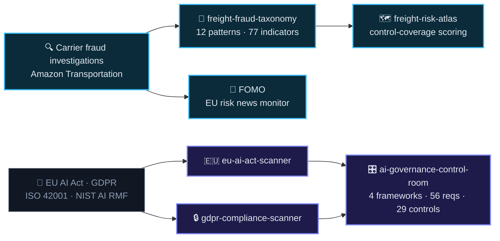

 

---

### ⚡ I do two things

<table>
<tr>
<td width="50%" valign="top">

#### 🚚 Catch freight fraud
Missing trailers, cargo theft, identity fraud, internal collusion — across **EU and NA lanes** for Amazon Transportation. Then I write down the method so other teams can use it.

</td>
<td width="50%" valign="top">

#### ⚖️ Make regulation usable
EU AI Act, GDPR, ISO/IEC 42001, NIST AI RMF — turned into tools a team can act on in an **afternoon** instead of a quarter.

</td>
</tr>
</table>

*Everything below runs client-side or offline. No uploads, no server, no telemetry, **zero dependencies**.*

---

### 🧬 How the pieces connect

---

### 🚚 Freight &amp; carrier fraud

<table>
<tr><td width="30%" valign="top">

**[freight-fraud-taxonomy](https://github.com/Jeevan-0508/freight-fraud-taxonomy)**

</td><td valign="top">

An open reference taxonomy of freight and carrier fraud — **12 patterns**, **77 detection indicators**, **137 countermeasures** split preventive / detective / responsive, plus **31 false-positive tests** so the indicators don't fire on legitimate carriers. Sourced to 11 public references.

</td></tr>

<tr><td width="30%" valign="top">

**[freight-risk-atlas](https://github.com/Jeevan-0508/freight-risk-atlas)**

</td><td valign="top">

A carrier risk **assessment** engine — scores how well controls cover three stages: pre-award, in transit, post-event. It measures coverage, not probability of fraud, and says so. Ships an interactive detection timeline and a fraud-pattern relationship network.

</td></tr>

<tr><td width="30%" valign="top">

**[FOMO](https://github.com/Jeevan-0508/FOMO)**

</td><td valign="top">

A logistics and supply-chain risk news monitor for the German/EU market. English **and** German sources, categorised by risk type, re-scanned automatically every six hours by a GitHub Action.

</td></tr>
</table>

### ⚖️ AI governance &amp; compliance

<table>
<tr><td width="30%" valign="top">

**[ai-governance-control-room](https://github.com/Jeevan-0508/ai-governance-control-room)**

</td><td valign="top">

An operator console for AI governance. **4 frameworks** mapped to **56 requirements** and **29 controls**, with **84 evidence artefacts** — so for any one control you can see everything it satisfies at once. 8 controls span three or more frameworks.

</td></tr>

<tr><td width="30%" valign="top">

**[eu-ai-act-scanner](https://github.com/Jeevan-0508/eu-ai-act-scanner)**

</td><td valign="top">

Classify an AI system against **Regulation (EU) 2024/1689** in about ten minutes. **14 risk-qualifier questions**, each mapped to a specific article with an "explain why" panel → **22 requirements across 5 risk tiers** → compliance score, ISO 42001 + NIST AI RMF crosswalks, exportable report.

</td></tr>

<tr><td width="30%" valign="top">

**[gdpr-compliance-scanner](https://github.com/Jeevan-0508/gdpr-compliance-scanner)**

</td><td valign="top">

Drop in a CSV / Excel / JSON file, get an instant GDPR exposure report: which columns hold personal data, how sensitive, what to do about it. **35 field-name rules + 9 value-regex detectors**, risk score out of 100. Parsing happens in your browser — the file never leaves your machine.

</td></tr>
</table>

---

### 📊 What this looks like at work

**Risk Manager · Amazon Transportation · ROC / TIO / RCMT**

| | |
|:--|--:|
| Model-driven fraud prevention impact | **&gt;$15M** |
| Reduction in EU/NA carrier-audit false positives | **~40%** |
| Loss-forecasting engine accuracy | **~95%** |
| Risk reporting automated, manual → generated | **~90%** |
| Monthly audit events monitored | **80K+** |
| Investigators working off the RCMT wiki + SOPs I wrote | **20+** |

I apply <b>DMAIC</b> to risk problems: find the risk → analyse the data behind it → automate the manual step out of it → measure whether it actually moved.

---

### 🛠️ Stack

`AWS Lambda` `Bedrock` `Connect` `Lex` `SQL` `Power BI` `GitHub Actions` `Pandas`

`EU AI Act (Reg. 2024/1689)` `GDPR` `ISO/IEC 42001` `NIST AI RMF` `ISO 28000` `Lean Six Sigma / DMAIC`

<b>🏆 Certifications</b>

 

- ☁️ **AWS Certified Solutions Architect**
- 📊 **Lean Six Sigma Black Belt** &amp; **Green Belt**
- 🔐 **ISO 28000** Supply Chain Security · **ISO 9001** Internal Auditor
- 🛡️ **Cybersecurity Foundations** · **Power BI / Data Analytics** · **Risk Management**

<b>🧰 Other things I've built</b>

 

- **[All-in-one-desk](https://github.com/Jeevan-0508/All-in-one-desk)** — offline-first Python productivity suite: document conversion, OCR, KPI calculators, email and flowchart generators. Flask · Tesseract · LibreOffice · PyInstaller.
- **[hakai-protocol-v2](https://github.com/Jeevan-0508/hakai-protocol-v2)** — a real-life RPG for habits: quests, XP, gear, bosses, streaks. Zero dependencies, offline save system. **[Live](https://jeevan-0508.github.io/hakai-protocol-v2)**
- **[a-conversation-with-existence](https://github.com/Jeevan-0508/a-conversation-with-existence)** — a book I wrote.

<b>🌱 What I'm working toward</b>

 

- Deepening the **EU AI Act / ISO 42001 / NIST AI RMF** intersection beyond what the tools already encode
- Applying **anomaly detection** to carrier fraud patterns
- Moving into **AI governance / risk roles in the EU market**

---

  

---

### 📫 Let's talk

Open to **AI governance**, **risk management** and **automation** roles.

 

⭐ If any of these are useful to you, a star helps.

