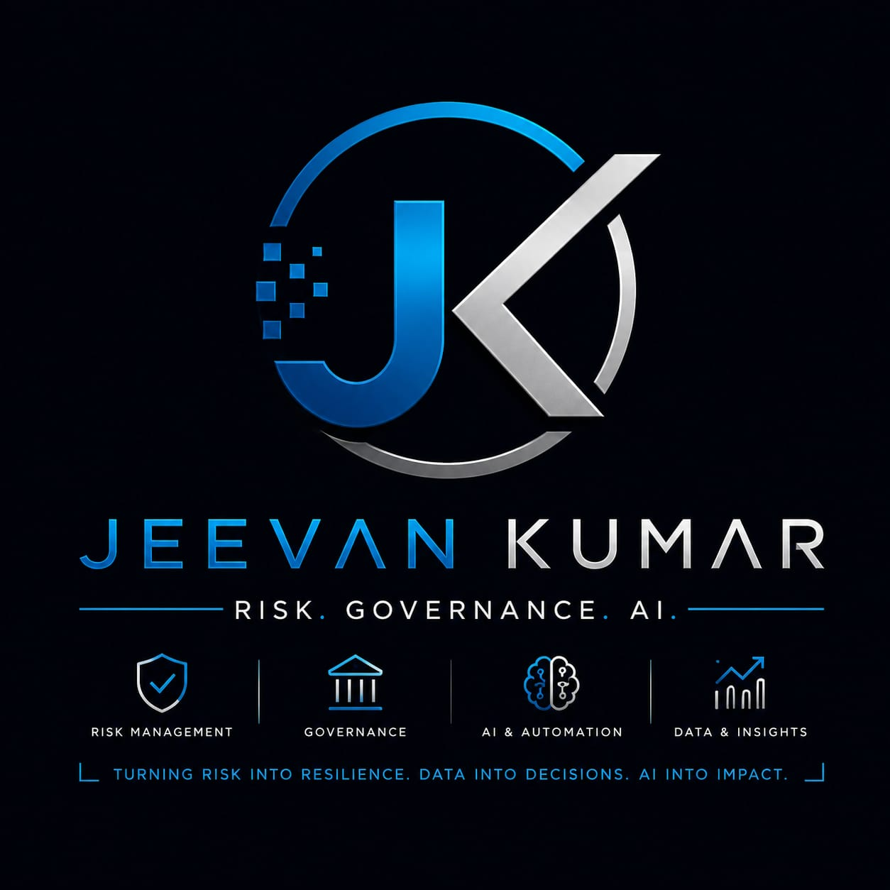

# Hi, I'm Jeevan! 👋

### Risk Manager | AWS Solutions Architect | Automation Engineer | Lean Six Sigma Expert

---

## 🚀 About Me

I'm a **Risk Manager** and **AWS Certified Solutions Architect** who builds automation solutions that eliminate risk, protect data, and streamline operations at scale.

I specialize in creating **offline-first, privacy-focused tools** that handle sensitive data securely — with zero cloud dependency and zero data exposure. My work sits at the intersection of **risk management, process automation, and cloud architecture**.

> 🔒 "Build secure. Automate smart. Eliminate risk."

---

## 🎯 What I Do

- 🛡️ **Risk Management** — Identify, assess, and mitigate operational risks across complex systems
- ☁️ **AWS Solutions Architecture** — Design scalable, secure cloud solutions (Certified AWS Solutions Architect)
- ⚙️ **Process Automation** — Build tools that reduce manual effort and improve data integrity
- 📊 **Lean Six Sigma** — Drive continuous improvement, eliminate false positives, and optimize workflows
- 🔐 **Data Sensitivity** — Handle highly confidential data with strict privacy-first approach

---

## 🛠️ Tech Stack

**Cloud & AI:** AWS Lambda · Amazon Bedrock · Amazon Connect · Amazon Lex
**Tools:** Tesseract OCR · LibreOffice · PyInstaller · Lean Six Sigma · DMAIC

---

## 📌 Featured Projects

### 🖥️ [All-in-one-desk](https://github.com/Jeevan-0508/All-in-one-desk)
> An offline-first Python productivity and automation suite with 15+ tools — all running locally on your machine. Zero cloud dependency. Zero risk of data exposure.

**Why I Built This:**
As a Risk Manager handling sensitive data daily, I needed tools that **never send data to the cloud**. This suite solves that problem — document conversion, text processing, KPI calculations, and more — all 100% local and secure.

**Key Features:**
- 📄 Document Conversion (PDF ↔ Word, Excel/CSV → TXT, Image → Text via OCR)
- ✏️ Text Processing (Formatter, Duplicate Remover, Text Diff)
- 📊 Data & Analytics (KPI Calculator, Dashboard, Risk Notes)
- 🤖 Productivity & AI (Email Generator, Flowchart Generator, Knowledge Assistant)
- 🧘 Wellness (Smart Break Reminders)

**Tech:** Python (Flask) · HTML/CSS/JS · Tesseract OCR · LibreOffice · PyInstaller

---

## 🏆 Certifications

- ☁️ **AWS Certified Solutions Architect** (2026)
- 📊 **Lean Six Sigma Expert** — Process Improvement & Risk Elimination

---

## 📈 My Approach
Identify Risk → Analyze Data → Automate Solution → Measure Impact → Eliminate Waste

I follow the **DMAIC methodology** (Define, Measure, Analyze, Improve, Control) to continuously improve processes and deliver measurable results:

- 🎯 **80% improvement** in data integrity through automation
- ⏱️ **83% reduction** in resolution time (18 days → 3 days)
- 🔄 **12+ risk mitigation projects** delivered successfully

---

## 📊 GitHub Stats

---

## 🌱 Currently Exploring

- Advanced AWS architecture patterns
- AI/ML for risk prediction and anomaly detection
- Serverless automation with AWS Lambda
- Infrastructure as Code (IaC)

---

## 📫 Connect With Me

- 💼 [GitHub](https://github.com/Jeevan-0508)
- 📧 Open to collaboration on automation, risk management, and cloud solutions!

---

⭐ *If you find my projects useful, consider giving them a star!*
