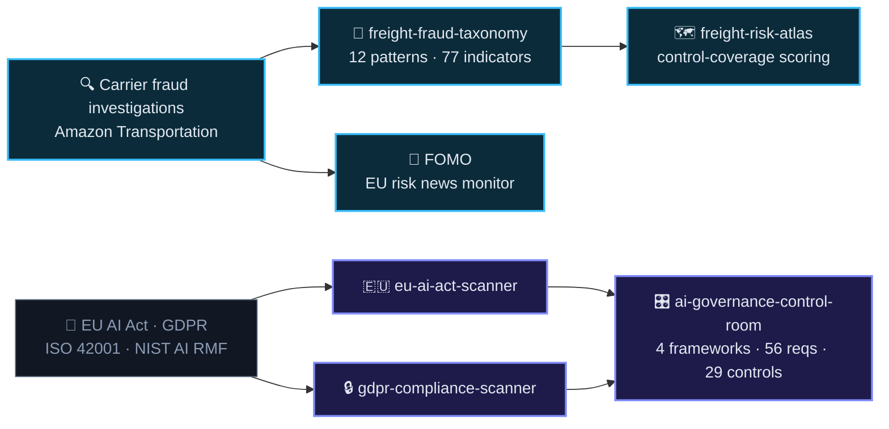

 

---

### ⚡ Here's what I do

<table>
<tr>
<td width="50%" valign="top">

#### 🚚 Catch freight fraud
Missing trailers, cargo theft, identity fraud, internal collusion — across **EU and NA lanes** for Amazon Transportation. Then I write down the method so other teams can use it.

</td>
<td width="50%" valign="top">

#### ⚖️ Make regulation usable
EU AI Act, GDPR, ISO/IEC 42001, NIST AI RMF — turned into tools a team can act on in an **afternoon** instead of a quarter.

</td>
</tr>
</table>

*Everything below runs client-side or offline. No uploads, no server, no telemetry, **zero dependencies**.*

---

### 🧬 How the pieces connect

---

### 🚚 Freight &amp; carrier fraud

<table>
<tr><td width="30%" valign="top">

**[freight-fraud-taxonomy](https://github.com/Jeevan-0508/freight-fraud-taxonomy)**

</td><td valign="top">

An open reference taxonomy of freight and carrier fraud — **12 patterns**, **77 detection indicators**, **137 countermeasures** split preventive / detective / responsive, plus **31 false-positive tests** so the indicators don't fire on legitimate carriers. Sourced to 11 public references.

</td></tr>

<tr><td width="30%" valign="top">

**[freight-risk-atlas](https://github.com/Jeevan-0508/freight-risk-atlas)**

</td><td valign="top">

A carrier risk **assessment** engine — scores how well controls cover three stages: pre-award, in transit, post-event. It measures coverage, not probability of fraud, and says so. Ships an interactive detection timeline and a fraud-pattern relationship network.

</td></tr>

<tr><td width="30%" valign="top">

**[FOMO](https://github.com/Jeevan-0508/FOMO)**

</td><td valign="top">

A logistics and supply-chain risk news monitor for the German/EU market. English **and** German sources, categorised by risk type, re-scanned automatically every six hours by a GitHub Action.

</td></tr>

<tr><td width="30%" valign="top">

**[fraud-watch](https://github.com/Jeevan-0508/fraud-watch)**

</td><td valign="top">

A living freight-fraud investigation simulator. A freight network runs itself — trucks, drivers, trailers and carriers over a real topology — and the analyst sees only what was *recorded*. What actually happened is held in the simulation and is structurally unreachable from every analyst-facing surface, so the exercise cannot be gamed by reading the answer.

</td></tr>

<tr><td width="30%" valign="top">

**[shrink-signal](https://github.com/Jeevan-0508/shrink-signal)**

</td><td valign="top">

A loss-prevention reading of European police-recorded crime: **8 Eurostat offence categories**, **41 countries**, 2008–2024 — plus a German **BKA** panel that reaches 2025, carries a shoplifting category Eurostat has no code for, and breaks down to all **16 Bundesländer**. The reasons it might be wrong are printed above the charts, not in a footnote.

</td></tr>

<tr><td width="30%" valign="top">

**[one-more-shift](https://github.com/Jeevan-0508/one-more-shift)**

</td><td valign="top">

A tiny farewell arcade game built on the taxonomy above: flag or clear **108 real cards** — 77 genuine risk indicators, 31 genuine innocent explanations — against a 60-second clock that tightens its pace in the last third. Best score persists locally. No invented data, no backend.

</td></tr>
</table>

### ⚖️ AI governance &amp; compliance

<table>
<tr><td width="30%" valign="top">

**[ai-governance-control-room](https://github.com/Jeevan-0508/ai-governance-control-room)**

</td><td valign="top">

An operator console for AI governance. **4 frameworks** mapped to **56 requirements** and **29 controls**, with **84 evidence artefacts** — so for any one control you can see everything it satisfies at once. 8 controls span three or more frameworks.

</td></tr>

<tr><td width="30%" valign="top">

**[eu-ai-act-scanner](https://github.com/Jeevan-0508/eu-ai-act-scanner)**

</td><td valign="top">

Classify an AI system against **Regulation (EU) 2024/1689** in about ten minutes. **14 risk-qualifier questions**, each mapped to a specific article with an "explain why" panel → **22 requirements across 5 risk tiers** → compliance score, ISO 42001 + NIST AI RMF crosswalks, exportable report.

</td></tr>

<tr><td width="30%" valign="top">

**[gdpr-compliance-scanner](https://github.com/Jeevan-0508/gdpr-compliance-scanner)**

</td><td valign="top">

Drop in a CSV / Excel / JSON file, get an instant GDPR exposure report: which columns hold personal data, how sensitive, what to do about it. **35 field-name rules + 9 value-regex detectors**, risk score out of 100. Parsing happens in your browser — the file never leaves your machine.

</td></tr>

<tr><td width="30%" valign="top">

**[reg-search](https://github.com/Jeevan-0508/reg-search)**

</td><td valign="top">

Natural-language search over the Control Room's 56 cited requirements, ranked with a **BM25 implementation written from scratch** — no embeddings, no external model, no API key. Shows exactly which query terms earned a result its rank.

</td></tr>

<tr><td width="30%" valign="top">

**[dora-compliance-scanner](https://github.com/Jeevan-0508/dora-compliance-scanner)**

</td><td valign="top">

Self-assessment coverage against **Regulation (EU) 2022/2554 (DORA)** — **19 cited requirements** across the ICT risk-management, incident-reporting, resilience-testing and third-party pillars. Answer, score, export; the citation for every requirement travels with it.

</td></tr>

<tr><td width="30%" valign="top">

**[POLICY//AUDIT](https://github.com/Jeevan-0508/policy-audit)**

</td><td valign="top">

The evidence side of governance: feed it a document corpus (policy, architecture, code) and it finds where regulation → control → documented policy → actual implementation diverges, with every finding traced back to the source text. Doesn’t replace a control room — feeds one.

</td></tr>
</table>

---

### 🧪 Risk tooling &amp; multi-agent systems

<table>
<tr><td width="30%" valign="top">

**[risk-swarm](https://github.com/Jeevan-0508/risk-swarm)**

</td><td valign="top">

Seven named agents investigate a real repository together — one maps it, one stress-tests it, one audits the others. **815 tests across 60 files, 30 of them adversarial attacks** (16 guard-layer + 14 council-layer) against the agents themselves, because an investigator you cannot attack is one you cannot trust.

</td></tr>

<tr><td width="30%" valign="top">

**[shadow-network](https://github.com/Jeevan-0508/shadow-network)**

</td><td valign="top">

A persistent synthetic freight-carrier economy that ticks forward one real day at a time via an unattended GitHub Action, while a BYOK AI council investigates flagged incidents from a redacted case brief that never carries the sim's own ground truth. A public leaderboard tracks the council's win rate against fraud it never gets to see labelled.

</td></tr>

<tr><td width="30%" valign="top">

**[risk-os](https://github.com/Jeevan-0508/risk-os)**

</td><td valign="top">

An operational risk register that runs entirely in the browser — register, scoring, treatment plans and review cycles, with import/export so the data stays yours. No account, no server, no telemetry.

</td></tr>

<tr><td width="30%" valign="top">

**[RISK//REPLAY](https://github.com/Jeevan-0508/risk-replay)**

</td><td valign="top">

AI decision forensics: replay a model’s past decision deterministically, mutate one input, and see exactly how the outcome and its governance score would have changed — a counterfactual you can inspect, not just an accuracy number.

</td></tr>

<tr><td width="30%" valign="top">

**[RISK//RING](https://github.com/Jeevan-0508/risk-ring)**

</td><td valign="top">

A trained fraud classifier evaluated against ground truth from a simulator built to have some (structuring, layering, collusion rings), not a downloaded 99.8%-legitimate CSV. Honest metrics, SHAP explainability, graph-based collusion-ring detection.

</td></tr>

<tr><td width="30%" valign="top">

**[FORECAST//LEDGER](https://github.com/Jeevan-0508/Forecast-Ledger)**

</td><td valign="top">

Seals a forecast before the outcome exists, grades it once reality arrives, and refuses to forecast when the history can’t support the evaluation protocol. Real Eurostat data, rolling-origin backtest, MASE, no hindsight.

</td></tr>
</table>

### 🌌 Science, built to be explored

<table>
<tr><td width="30%" valign="top">

**[scale-of-everything](https://github.com/Jeevan-0508/scale-of-everything)**

</td><td valign="top">

An interactive zoom through **ten scales of the universe**, from one planet surface to the edge of the observable universe — then two steps further, into territory explicitly labelled *not measured*. Two AI models run in your browser: one searches by meaning, one talks.

</td></tr>

<tr><td width="30%" valign="top">

**[quantum-galaxy](https://github.com/Jeevan-0508/quantum-galaxy)**

</td><td valign="top">

An interactive 3D galaxy for quantum physics: **20 concepts** orbit as planets across **5 themed solar systems** around a central black hole. Ask a question in plain language and an in-browser AI flies you to the concept that answers it.

</td></tr>
</table>

### 🎮 Interactive engineering

<table>
<tr><td width="30%" valign="top">

**[NIGHTFALL // ZERO](https://github.com/Jeevan-0508/nightfall-zero)**

</td><td valign="top">

A browser survival-shooter with a deterministic engine underneath the spectacle: waves, weapons, bosses, maps and loadouts, built in autonomous phased sessions with a real test suite over the pure engine/AI/collision logic.

</td></tr>

<tr><td width="30%" valign="top">

**[HAKAI // WORLD](https://github.com/Jeevan-0508/hakai_world)**

</td><td valign="top">

An explorable 2.5D living world built from the [HAKAI Protocol](https://github.com/Jeevan-0508/hakai-protocol-v2) universe — same creatures and lore, walked into instead of clicked through. Two known test failures are named in the README, not hidden.

</td></tr>

<tr><td width="30%" valign="top">

**[RULESHIFT](https://github.com/Jeevan-0508/ruleshift)**

</td><td valign="top">

A puzzle game where the rules are never quite what they seem — every generated level is BFS-verified solvable before it’s shown, so a level that looks unfair is provably not.

</td></tr>
</table>

---

### 📊 What this looks like at work

**Risk Manager · Amazon Transportation · ROC / TIO / RCMT**

| | |
|:--|--:|
| Model-driven fraud prevention impact | **&gt;$15M** |
| Reduction in EU/NA carrier-audit false positives | **~40%** |
| Loss-forecasting engine accuracy | **~95%** |
| Risk reporting automated, manual → generated | **~90%** |
| Monthly audit events monitored | **80K+** |
| Investigators working off the RCMT wiki + SOPs I wrote | **20+** |

I apply <b>DMAIC</b> to risk problems: find the risk → analyse the data behind it → automate the manual step out of it → measure whether it actually moved.

---

### 🛠️ Stack

**Build**

<i>hover any icon for its name</i>

**Risk &amp; fraud**

**Governance &amp; standards**

**Data &amp; method**

`AWS Lambda` `Amazon Bedrock` `Amazon Connect` `Amazon Lex` `Regulation (EU) 2024/1689`

<b>🏆 Certifications</b>

 

- ☁️ **AWS Certified Solutions Architect**
- 📊 **Lean Six Sigma Black Belt** &amp; **Green Belt**
- 🔐 **ISO 28000** Supply Chain Security · **ISO 9001** Internal Auditor
- 🛡️ **Cybersecurity Foundations** · **Power BI / Data Analytics** · **Risk Management**

<b>🧰 Other things I've built</b>

 

- **[All-in-one-desk](https://github.com/Jeevan-0508/All-in-one-desk)** — offline-first Python productivity suite: document conversion, OCR, KPI calculators, email and flowchart generators. Flask · Tesseract · LibreOffice · PyInstaller.
- **[hakai-protocol-v2](https://github.com/Jeevan-0508/hakai-protocol-v2)** — a real-life RPG for habits: quests, XP, gear, bosses, streaks. Zero dependencies, offline save system. **[Live](https://jeevan-0508.github.io/hakai-protocol-v2)**
- **[a-conversation-with-existence](https://github.com/Jeevan-0508/a-conversation-with-existence)** — a book I wrote.
- **[mind-galaxy](https://github.com/Jeevan-0508/mind-galaxy)** — the book's 18 chapters, laid out as an explorable 3D galaxy instead of a table of contents.

<b>🌱 What I'm working toward</b>

 

- Deepening the **EU AI Act / ISO 42001 / NIST AI RMF** intersection beyond what the tools already encode
- Applying **anomaly detection** to carrier fraud patterns
- Moving into **AI governance / risk roles in the EU market**

---

<picture>
  <source media="(prefers-color-scheme: dark)" srcset="https://raw.githubusercontent.com/Jeevan-0508/Jeevan-0508/output/snake-dark.svg" />
  <source media="(prefers-color-scheme: light)" srcset="https://raw.githubusercontent.com/Jeevan-0508/Jeevan-0508/output/snake-light.svg" />
  
</picture>

  

  

---

### 📫 Let's talk

Open to **AI governance**, **risk management** and **automation** roles.

 

⭐ If any of these are useful to you, a star helps.

