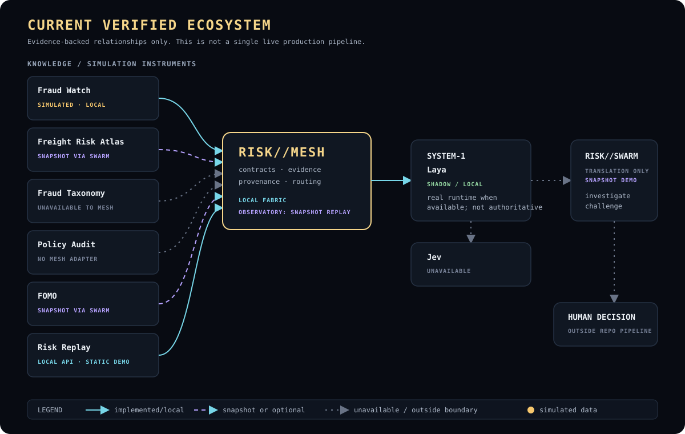

# Jeevan Siddhabhaktula

## AI risk intelligence engineering

AI governance · fraud intelligence · decision forensics · evidence-led systems

I build systems that investigate risk, challenge decisions, and preserve the evidence behind them.

My professional background is in supply-chain and logistics risk. My open-source work turns that experience into deterministic tools, synthetic investigations, governance evidence, and decision replay for Germany/EU-relevant risk questions.

**Systems that refuse to lie.**

[Portfolio](https://jeevan-0508.github.io) · [LinkedIn](https://www.linkedin.com/in/jeevan-siddhabhaktula-6927041a2/) · [Email](mailto:jeevansiddhabhaktula@gmail.com)

---

## The short version

This is one research and engineering program, expressed as separate instruments:

```text
knowledge + simulation  →  RISK//MESH  →  investigation / challenge  →  decision forensics
freight fraud            →  evidence + provenance + explicit capability boundaries
AI governance            →  controls, documents, implementation gaps, and audit trails
```

The repositories are not a single deployed product. Where a connection exists, it is an explicit adapter, fixture, or hash-verified snapshot. Static GitHub Pages cannot launch a local Python service, and unavailable providers are surfaced as unavailable.



The diagram shows the current verified boundary, not a target architecture: solid lines are implemented/local, dashed lines are snapshots or optional paths, muted lines are unavailable or outside the repository pipeline, and amber markers identify simulated data.

## Flagship systems

### [RISK//MESH](https://github.com/Jeevan-0508/Risk-Mesh) · [Observatory](https://jeevan-0508.github.io/Risk-Mesh/observatory/)

Risk-intelligence fabric for contracts, evidence, provenance, cases, arbitration, and learning across independent risk systems.

**Visual proof:** [open the neural Observatory](https://jeevan-0508.github.io/Risk-Mesh/observatory/) — a real orb-and-ledger replay of captured golden cases and System-1 shadow runs.

**Status:** `LOCAL` contracts and engines · `SNAPSHOT` Observatory data · Laya `SHADOW` checkpoints when the runtime is available · Jev `UNAVAILABLE` · no production traffic. The Observatory is a replay of captured cases, not a live cross-repository feed.

### [Fraud Watch](https://github.com/Jeevan-0508/fraud-watch) · [Live demo](https://jeevan-0508.github.io/fraud-watch/)

An adversarial fraud-evolution laboratory: a synthetic freight world produces observable behaviour, signals, investigations, candidate mutations, and analyst-reviewed outcomes while hidden intent remains inaccessible to the analyst.


**Status:** `SIMULATED` synthetic world · `DETERMINISTIC` seeded engines · scheduled GitHub Action advances persisted snapshots · no machine learning and no real operational data.

### [RISK//SWARM](https://github.com/Jeevan-0508/risk-swarm) · [Live demo](https://jeevan-0508.github.io/risk-swarm/)

Seven-agent risk investigation with evidence provenance, disagreement, red-team review, governance gates, and a recommendation that remains subject to human decision.


**Status:** `DEMO` uses pinned, hash-verified snapshots with no key and no network · `SNAPSHOT` mode preserves the same knowledge against the real clock · provider-backed paths are `OPTIONAL` and must fail closed.

### [RISK//REPLAY](https://github.com/Jeevan-0508/risk-replay) · [Live demo](https://jeevan-0508.github.io/risk-replay/)

Decision forensics and counterfactual replay: reconstruct a recorded decision, mutate evidence or inputs, and inspect what changes under the declared replay model.


**Status:** Pages demo is `SNAPSHOT`/static with synthetic data and no LLM in the decision path · FastAPI backend is `LOCAL` and separately testable · replay is not a claim about real-world causation.

### [POLICY//AUDIT](https://github.com/Jeevan-0508/policy-audit) · [Live demo](https://jeevan-0508.github.io/policy-audit/)

Client-side governance evidence auditor that traces regulation → control → implementation → evidence → gap, including contradictions and policy/implementation conflicts.

**Status:** `LOCAL`/`DETERMINISTIC` browser engine · optional LLM enhancement is not wired into the shipped build · no backend, account, or upload service.

### [Freight Risk Atlas](https://github.com/Jeevan-0508/freight-risk-atlas) · [Live demo](https://jeevan-0508.github.io/freight-risk-atlas/)

Structured freight-fraud assessment engine that reports indicator coverage, evidence completeness, false-positive gates, and stage-appropriate countermeasures without pretending to estimate fraud probability.


**Status:** `LOCAL`/`DETERMINISTIC` browser tool · open taxonomy model · no incident data and no probability claim.

---

## Supporting research

- [Freight & Carrier Fraud Risk Taxonomy](https://github.com/Jeevan-0508/freight-fraud-taxonomy) — 12 structured patterns, 93 indicators, 31 false-positive records, 143 countermeasures, and public references.
- [AI Risk Control Room](https://github.com/Jeevan-0508/ai-governance-control-room) — four frameworks, 56 requirements, 29 controls, evidence records, and a browser-only operator console.
- [FOMO](https://github.com/Jeevan-0508/FOMO) — scheduled German/EU logistics-risk news snapshot with English and German sources.
- [Forecast Ledger](https://github.com/Jeevan-0508/Forecast-Ledger) — forecast sealing and rolling-origin evaluation with refusal when the history cannot support the protocol.
- [Shadow Network](https://github.com/Jeevan-0508/shadow-network) — persistent synthetic carrier economy and BYOK council investigation.
- [Risk Ring](https://github.com/Jeevan-0508/risk-ring) — simulated fraud classifier, honest metrics, SHAP explanations, and graph-based ring detection.
- [RISK//OS](https://github.com/Jeevan-0508/risk-os) — browser-first operational risk register and review workflow.
- [Reg Search](https://github.com/Jeevan-0508/reg-search) — cited requirement search with a from-scratch BM25 implementation.

## Creative engineering

[Nightfall Zero](https://github.com/Jeevan-0508/nightfall-zero) · [HAKAI World](https://github.com/Jeevan-0508/hakai_world) · [HAKAI Protocol v2](https://github.com/Jeevan-0508/hakai-protocol-v2) · [Scale of Everything](https://github.com/Jeevan-0508/scale-of-everything) · [Quantum Galaxy](https://github.com/Jeevan-0508/quantum-galaxy) · [RuleShift](https://github.com/Jeevan-0508/ruleshift) · [One More Shift](https://github.com/Jeevan-0508/one-more-shift)

These projects show interactive systems design, simulation, game mechanics, WebGL, and creative frontend engineering. They are intentionally separate from the risk-intelligence core.

## Legacy / lower-priority work

The older notebooks and utility projects remain public as history, but are not the centre of this portfolio: [Amazon Alexa sentiment](https://github.com/Jeevan-0508/amazon-alexa-sentiment-analysis), [medical insurance prediction](https://github.com/Jeevan-0508/medical-insurance-cost-prediction), [loan eligibility](https://github.com/Jeevan-0508/loan-eligibility-prediction), [telecom churn](https://github.com/Jeevan-0508/telecom-churn-prediction), [retail banking analysis](https://github.com/Jeevan-0508/retail-banking-predictive-analysis), and [HAKAI Protocol v1](https://github.com/Jeevan-0508/Hakai-Protocol).

## Verification principles

- Capability labels are explicit: `LIVE`, `LOCAL`, `SNAPSHOT`, `FIXTURE`, `SIMULATED`, `DETERMINISTIC`, `OPTIONAL`, or `UNAVAILABLE`.
- Evidence is separated from claims; replay is separated from causation; coverage is separated from probability.
- Synthetic worlds are labelled synthetic, and provider failures are visible rather than replaced with invented output.
- The strongest demos are linked above; their READMEs contain architecture, setup, tests, security notes, and limitations.

## Contact

Open to AI risk engineering, AI governance, responsible AI, fraud intelligence, assurance, and technical risk roles in Germany and the EU.
